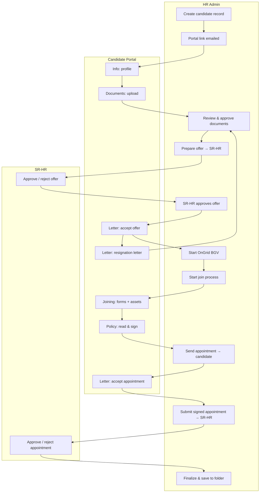

# Onboarding Portal — User Guide (HR & Candidate)

**Product:** Ami Polymer E-Digital Onboarding  
**Last updated:** June 2026  
**Audience:** HR Admin, Onboarding team, Candidates (new joiners), SR-HR approvers

---

## 1. Overview

The onboarding system has **two sides**:

| Side | Who | Access |
|------|-----|--------|
| **HR Admin** | HR / Onboarding team | Login → Dashboard → **Onboard Assistant → New Employee List** |
| **Candidate** | New joiner | **No login** — personal link by email (`/onboarding/{token}`) |
| **SR-HR** | Senior HR approver | Email link (`/sr-hr/approval/{token}`) — offer & appointment only |

Both sides share one **onboarding step** (`emp_onboarding_step`). HR sees full controls on the candidate **Show** page. The candidate sees only what is allowed at their current step in the **Candidate Onboarding Portal**.

---

## 2. End-to-end flow (both sides)

---

## 3. Onboarding stages (reference)

These appear in **New Employee List** as **Onboarding Stage** and on the candidate portal header as status text.

| Stage | Meaning | Typical owner |
|-------|---------|----------------|
| **Portal** | Invitation sent; candidate filling profile | Candidate |
| **Documents** | Upload / HR review of ID, education, employment proofs | Candidate + HR |
| **Offer** | Offer letter prepared, SR-HR approval, candidate accept/decline | HR + SR-HR + Candidate |
| **Registration** | Resignation acceptance letter from previous employer | Candidate + HR |
| **BGV** | OnGrid background verification | HR |
| **Join** | Joining forms, bank/PF, assets, medical | Candidate + HR |
| **Policy** | Company policies read & signed | Candidate |
| **Appointment** | Appointment letter, candidate sign, SR-HR approval | HR + SR-HR + Candidate |
| **Complete** | Onboarding finalized | HR |

**Doc. Status** (separate column in list) = document review only:

| Value | Meaning |
|-------|---------|
| In review | HR still reviewing uploads |
| Approved | All required documents approved |
| Rejected | Some documents rejected — candidate may re-upload |

---

## 4. HR Admin guide (start → end)

### 4.1 Login & navigation

1. Open the application URL and **log in** with HR credentials.
2. Go to **Dashboard → Onboard Assistant → New Employee List**  
   Route: `/onboard-assistant/new-employee-list`
3. Use **+ New** to add a candidate, or **Show** (eye icon) to open an existing record.

### 4.2 Step 1 — Create candidate

**Path:** New Employee List → **+ New**

| Field | Required | Notes |
|-------|----------|-------|
| Name, Email, Phone, DOB | Yes | Phone must be 10 digits for OnGrid |
| Department, Role, Location | Yes | Used in offer/appointment letters |
| Joining date (expected) | Optional | HR reference; candidate confirms later |
| Document due date | Yes | Shown to candidate in portal |

On save:

- System creates a **unique portal token** (`emp_url`).
- Candidate receives **email with onboarding portal link**.
- Step = **Invitation sent** (`start`).

### 4.3 Step 2 — Candidate fills profile & documents

**HR:** Open candidate **Show** page.

**Candidate (portal tabs):**

- **Info** — Basic info, education, employment, family (schema-driven).
- **Documents** — Upload Aadhaar, PAN, certificates, etc. (fresher vs experienced sets differ).

**HR actions:**

- Monitor **Onboarding Actions** panel (collapsible).
- In **Uploaded Documents** table: set each row to **Approved** or **Rejected** (remark required if rejected).
- Click **Save changes** at bottom of page.
- When all required docs are approved → overall **Doc. Status** = **Approved** (`completed`).

**HR can also:**

- **Allow profile re-edit** / **Allow document re-upload** (if candidate made mistakes).
- **Resend portal link** (only before profile is first submitted).

### 4.4 Step 3 — Offer letter

**When available:** Profile complete + documents submitted + HR approved all documents.

**HR:** Onboarding Actions → **Prepare Offer → SR-HR Approval**

1. Fill offer modal: name, role, designation, CTC, location, joining date.
2. Select **SR-HR approver** (from configured team).
3. **Save & Send to SR-HR for Approval**.

**SR-HR:** Receives email → opens approval link → **Approve** or **Reject** (reason required if reject).

| Outcome | Step | HR next action |
|---------|------|----------------|
| SR-HR **approved** | Offer awaiting SR-HR → Offer sent | Candidate gets offer email; signs in portal |
| SR-HR **rejected** | Offer rejected by SR-HR | HR sees reason → **Revise & Resubmit Offer → SR-HR** |
| Candidate **declines** | Offer declined | HR sees candidate reason → **Revise Offer After Candidate Decline → SR-HR** |

**Revise offer (update, not new record):**

- Same offer modal opens with existing data.
- HR updates CTC/role/etc., resubmits to SR-HR.
- Previous rejection reason is shown in the modal for reference.

**After candidate accepts offer:**

- Signed offer PDF saved under **Uploaded Documents** → *Signed Offer Letter (PDF)*.
- Step = **Offer accepted**.

### 4.5 Step 4 — Resignation acceptance letter (experienced hires)

**HR:** Onboarding Actions → **Request Resignation Acceptance Letter** (after offer accepted).

**Candidate:** **Letter** tab → upload PDF from previous employer.

**HR:**

- Approve in **Uploaded Documents** table, **or**
- Onboarding Actions → **Approve Resignation Letter (Documents)** when uploaded.

Step → **Registration verified**.

### 4.6 Step 5 — Background verification (OnGrid BGV)

**When available:** Documents approved + registration verified (if applicable).

**HR:** Onboarding Actions → **Start OnGrid BGV** (or **Start / Retry**)

- Select verification checks (default: CCRV, LAV, PAV, GDC, EMPV, EDUV).
- System calls OnGrid **initiate** API; stores `ongrid_id`.

**BGV status panel** (on Show page):

- Lists each check with **Request ID** and **Status** (OK / Failed with reason).
- **Refresh from OnGrid** loads live status.
- HR can mark **BGV Done** when satisfied.

**Early join (optional):**

- If BGV still running but candidate must join on schedule → **Early join (before BGV complete)** panel → allow with documented reason.

### 4.7 Step 6 — Start join process

**When available:** BGV complete **or** early join allowed.

**HR:** Onboarding Actions → pick **join date** → **Start Join Process**

- Join date must be within configured window (default: up to **5 days before** or **2 days after** today — see `config/onboarding.php` / `.env`).

**Candidate:** **Joining** tab opens — bank/PF, assets, gratuity, Form 25, medical upload, confirmed join date.

### 4.8 Step 7 — Company policy

**Candidate:** **Policy** tab (after joining forms submitted)

- Read each policy (view-only in portal — no download).
- Tick acceptance for required policies.
- Draw or upload signature → **Accept Policies & Submit Signature**.

**System:**

- Step = **Policy accepted**.
- Compliance PDF archived: **Company Policy Acceptance (Signed PDF)** in HR **Uploaded Documents** (for legal record).

### 4.9 Step 8 — Appointment letter

**HR:** After policy signed → **Send Appointment to Candidate** (or manual join today if date differs).

**Candidate:** **Letter** tab → view appointment → **Accept** with signature.

**HR:** **Submit Signed Appointment → SR-HR** (SR-HR approves final PDF).

After SR-HR approval → appointment PDF in documents → ready to **Finalize**.

### 4.10 Step 9 — Finalize onboarding

**HR:** Green banner → **Finalize & Save to Folder**

- Enter official **Employee ID**.
- All PDFs and uploads move to official employee folder.
- Step = **Onboarding complete** (`end`).

---

## 5. Candidate portal guide (start → end)

### 5.1 Access

- Candidate receives **email** with link:  
  `https://{your-domain}/onboarding/{token}`
- **No username/password** — keep the link private.
- Works on **mobile** (responsive layout).

### 5.2 Portal layout

| Area | Content |
|------|---------|
| Header | Company logo, candidate name, **status**, **Document due** date |
| Tabs | **Info · Document · Letter · Joining · Policy** |
| Tab content | Only actions allowed at current step |

### 5.3 Tab-by-tab (candidate actions)

#### Tab: **Info**

1. Fill all sections (basic, education, employment, family, etc.).
2. Use **Next / Save** to move through sections.
3. Submit profile when complete.  
   → HR sees profile; document upload unlocks.

#### Tab: **Document**

1. Complete **Info** first.
2. Upload required files (labels shown per fresher/experienced).
3. Submit documents.  
   → HR reviews and approves/rejects each file.

If HR rejects: candidate may get **re-upload** permission for specific documents.

#### Tab: **Letter**

| Phase | Candidate action |
|-------|------------------|
| After SR-HR approved offer | Read offer in page → **Accept** (signature) or **Reject** (reason min 10 chars) |
| After offer accepted | Upload **Resignation acceptance letter** (PDF) from previous employer |
| After HR sends appointment | Read appointment → **Accept** with signature or reject with reason |

Letters are shown in-page (iframe). HR/system letters are not uploaded by candidate here.

#### Tab: **Joining**

Opens when HR clicks **Start Join Process**.

- Confirm **join date**.
- Bank / PF / UAN details.
- Asset declaration, gratuity nomination, Form 25.
- Medical fitness PDF (if required).
- Guest house policy link if applicable.
- **Submit Joining Details** → then go to **Policy** tab.

#### Tab: **Policy**

1. Read policies one at a time (**View** opens read-only viewer).
2. Only **one policy open at a time**.
3. Tick “I have read and accept” for each required policy.
4. Sign (draw or upload JPG/PNG).
5. **Accept Policies & Submit Signature**.

Saving is blocked until all required policies are accepted and signed.

---

## 6. SR-HR approver guide (brief)

SR-HR does **not** use the main HR dashboard for approval.

1. Receives email: *Offer letter Approval* or *Appointment letter Approval*.
2. Clicks link → `/sr-hr/approval/{token}`.
3. Reviews letter preview.
4. **Approve** — HR can then send to candidate (offer) or PDF is archived (appointment).
5. **Reject** — must enter reason (min 10 characters). HR sees reason and can **revise & resubmit**.

---

## 7. HR Show page — panel reference

| Panel | Purpose |
|-------|---------|
| **Onboarding Actions** | Offer, BGV, join date, appointment, main workflow buttons |
| **Early join** | Allow join before BGV complete (with reason) |
| **BGV status (OnGrid)** | Live verification status per check |
| **SR-HR status** | Offer/appointment approval state, reassign approver |
| **Profile / employment HR dates** | HR-only last working date for previous employer (EMPV) |
| **Document re-edit / profile re-edit** | Controlled corrections |
| **Uploaded Documents** | Approve/reject all files + system PDFs |
| **Email reminders** | Resend portal, offer, SR-HR, registration emails |

---

## 8. Documents stored for compliance

| Document key | When created | Visible to |
|--------------|--------------|------------|
| Signed Offer Letter | Candidate accepts offer | HR documents |
| Resignation acceptance letter | Candidate uploads | HR documents |
| Signed appointment (SR-HR approved) | SR-HR approves appointment | HR documents |
| **Company Policy Acceptance (Signed PDF)** | Candidate signs policies | HR documents |
| OnGrid | External system | BGV panel + OnGrid portal |

Candidate portal **Documents** tab shows HR-managed letters for **view only** (not for candidate upload).

---

## 9. Common scenarios

### Candidate rejected the offer

1. HR opens Show page → red alert with **candidate reason**.
2. Click **Revise Offer After Candidate Decline → SR-HR**.
3. Update offer details → send to SR-HR again.
4. After SR-HR approval → candidate receives new offer link.

### SR-HR rejected the offer

1. HR sees **SR-HR reason** in alert.
2. Same **Revise & Resubmit Offer → SR-HR** button.
3. Fix issues SR-HR noted → resubmit.

### BGV failed (e.g. Invalid Aadhaar)

1. Open **BGV status** panel → **Refresh from OnGrid**.
2. Failed checks show red status; click for **reason**.
3. HR may allow **document re-upload** or profile fix, then **Start / Retry OnGrid BGV**.

### Join date not in allowed window

- **Start Join Process** button disabled until date is within allowed range.
- HR adjusts date picker; hint shows valid range under the button.

### Policy PDF not in HR documents

- Ensure candidate completed **Policy** tab after **Joining** submit.
- Check for error flash: “compliance PDF could not be saved” — contact IT (dompdf/storage permissions).

---

## 10. URLs & routes (technical reference)

| Action | Route / URL |
|--------|-------------|
| HR list | `/onboard-assistant/new-employee-list` |
| HR candidate show | `/onboard-assistant/new-employee-list/show/{id}` |
| Candidate portal | `/onboarding/{token}?tab=info\|document\|letter\|joining\|policy` |
| SR-HR approval | `/sr-hr/approval/{token}` |
| OnGrid status API | `/onboard-assistant/new-employee-list/get-status/{id}` |

---

## 11. Configuration (for admins)

| Setting | File / env |
|---------|------------|
| SR-HR approver emails | `.env` → `ONBOARDING_SR_HR_EMAILS` |
| SR-HR names/signatures | `form_join/sr-hr-team.json` |
| Company policies list | `form_join/company-policies.json` |
| Profile form fields | `form_join/profile-form-schema.json` |
| Joining form fields | `form_join/joining-form-schema.json` |
| Join date window (HR) | `ONBOARDING_JOIN_PROCESS_PAST_DAYS`, `ONBOARDING_JOIN_PROCESS_FUTURE_DAYS` |
| OnGrid API | `.env` → `ONGRID_*` (see `docs/ONGRID_INITIATE_VERIFICATION.md`) |

---

## 12. Quick checklist

### HR checklist

- [ ] Create candidate + correct document due date  
- [ ] Candidate profile & documents approved  
- [ ] Offer → SR-HR → candidate acceptance  
- [ ] Resignation letter (if experienced) verified  
- [ ] OnGrid BGV started and monitored  
- [ ] Join process started (valid join date)  
- [ ] Policy acceptance PDF on file  
- [ ] Appointment → candidate → SR-HR approved  
- [ ] Finalize & employee ID assigned  

### Candidate checklist

- [ ] Profile submitted  
- [ ] All documents uploaded  
- [ ] Offer accepted (signed)  
- [ ] Resignation letter uploaded (if asked)  
- [ ] Joining forms submitted  
- [ ] Policies read and signed  
- [ ] Appointment accepted (signed)  

---

## 13. Related documentation

- [PROJECT.md](PROJECT.md) — Technical architecture & modules  
- [ONGRID_INITIATE_VERIFICATION.md](ONGRID_INITIATE_VERIFICATION.md) — OnGrid BGV API & checks  

---

*For access issues, route permissions, or OnGrid credentials, contact your system administrator.*
