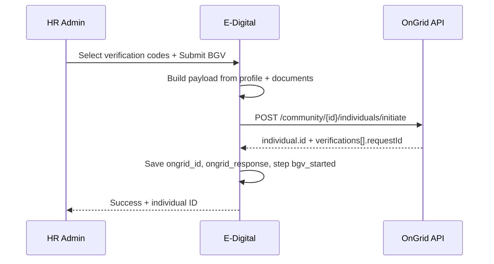

# OnGrid API — Onboarding and Initiate Verification

**Status:** Implemented (June 2026)  
**Postman source:** `OnGrid API Collection.postman_collection.json` → request **"Onboarding and Initiate Verification Copy"**  
**Last updated:** June 2026

---

## 1. Purpose

Replace (or run alongside) the current **invite-only** BGV flow with OnGrid’s **single-call** API that:

1. Creates the individual in the community (onboarding), and  
2. **Starts background verifications immediately** (no separate candidate invite link step for those checks).

This fits APPL onboarding when HR has already collected profile + documents in the portal and wants BGV to start from HR admin.

---

## 2. Current implementation (live)

| Item | Value |
|------|--------|
| Controller | `App\Http\Controllers\OnGridWeb\OnGridWebController` |
| HR action | **Start OnGrid BGV** → `bvgLink()` |
| API | `POST {baseUrl}/community/{communityId}/individuals/initiate` |
| Single class | `App\Support\OnGrid` (API, payload, PDF base64, offering list) |
| Stored | `ongrid_id` = `individual.id`, `ongrid_response` = full JSON + `initiated_at` |
| Status poll | `GET /individual/{ongrid_id}` via `getStatus()` and invite show page |

---

## 3. Target API (Postman — approved for integration)

### 3.1 Endpoint

| Field | Value |
|--------|--------|
| **Name** | Onboarding and Initiate Verification |
| **Method** | `POST` |
| **URL** | `{ONGRID_BASE_URL}/community/{ONGRID_COMMUNITY_ID}/individuals/initiate` |
| **Example (staging)** | `https://api-staging.ongrid.in/app/v1/community/{communityId}/individuals/initiate` |
| **Auth** | HTTP Basic (`ONGRID_USERNAME`, `ONGRID_PASSWORD`) |
| **Headers** | `Accept: application/json`, `Content-Type: application/json` |

Same auth and base URL as existing `config/services.php` → `services.ongrid`.

### 3.2 Success response (example from Postman)

```json
{
  "individual": {
    "id": 52843,
    "name": "Test",
    "employeeId": "90908",
    "uidvRequestId": 88957,
    "uans": ["100904319456"]
  },
  "verifications": [
    { "code": "LAV", "key": "QWASZHX78", "requestId": 88958 },
    { "code": "PAV", "key": "QWASZX878", "requestId": 88959 },
    { "code": "CCRV", "key": "QASWEPO09", "requestId": 88960 }
  ]
}
```

**Proposed storage after success:**

| Field | Suggested value |
|--------|------------------|
| `ongrid_id` | `individual.id` (not `inviteId`) |
| `ongrid_response` | Full JSON response |
| Optional new JSON keys in `ongrid_response` or `emp_other` | `verifications[]`, `initiated_at` |

### 3.3 Error responses (from Postman)

| Case | HTTP | Message / behaviour |
|------|------|---------------------|
| Invalid verification code | 400 | e.g. `"CCVF"` not in enum |
| Unsupported code for community | 400 | e.g. `"Verification code - 'CC' not supported."` |
| Missing prerequisite data | 400 | e.g. `"No DL found to initiate DLV."` |
| Invalid `data` shape for code | 400 | Deserialization / validation errors |

---

## 4. Request body structure

### 4.1 Profile block (maps to existing portal data)

| OnGrid field | Mandatory | APPL source |
|--------------|-----------|-------------|
| `name` | Yes | `emp_profile_data.information.basic_information.name` / `emp_name` |
| `professionId` | Yes | `profession_id` / `post_apply` / `emp_role` |
| `gender` | Yes | Profile basic |
| `city` | Yes | Profile basic |
| `phone` | Yes | Profile basic / `emp_phone` |
| `phoneCountryCode` | Recommended | Profile (default `+91`) |
| `uid` | Optional | Aadhaar — triggers Aadhaar verification if set |
| `email` | Recommended | Profile / `emp_email` |
| `dob` | Yes | `Y-m-d` |
| `hasConsent` | Yes | Declaration / BGV consent |
| `consentText` | Yes | Declaration |
| `permanentAddress` | Yes | `address_details` (`co`, `line1`, `locality`, `landmark`, `fullAddress`; optional `district`, `state`, `pincode`) |
| `currentAddress` | Yes | `current_full_address` |
| `fathersName` | Yes | Profile basic |
| `employeeId` | Recommended | `displayEmployeeId()` / `emp_folder` |
| `alternatePhone` / `alternatePhoneCountryCode` | Optional | Profile basic |
| `joiningDate` | Optional | Profile / `emp_date` |
| `deduplicationKeys` | Recommended | Same value as `employeeId` per OnGrid note |
| `uans` | Recommended | PF UAN from profile |

**Builder:** `OnGrid::buildInitiatePayload()`.

### 4.2 Verifications block (replaces `offerings[]`)

```json
"verifications": [
  { "code": "CCRV" },
  { "code": "GDC" },
  {
    "code": "EMPV",
    "key": "optional-client-ref",
    "data": {
      "employmentRecord": { ... }
    }
  },
  {
    "code": "EDUV",
    "key": "optional-client-ref",
    "data": {
      "educationDocument": { ... }
    }
  }
]
```

| Code | Data required? | Notes |
|------|----------------|-------|
| `CCRV` | No extra `data` | Needs permanent + current address, father's name in profile |
| `GDC` | No | Name, DOB, father's name |
| `LAV`, `PAV`, `PANV`, `VIDV`, `DLV`, etc. | Often `key` only | See Postman samples |
| `EMPV` | **Yes** — `employmentRecord` + `documents[]` | Map from profile employment + uploaded salary/appointment docs |
| `EDUV` | **Yes** — `educationDocument` + `documents[]` | Map from education rows + certificate uploads |

**Valid codes (from OnGrid enum in Postman error):**  
`EDUV`, `LAV`, `PADV`, `CCRV`, `PAV`, `GDC`, `LADV`, `EMPV`, `PCC`, `BV`, `AV`, `PAPV`, `PANV`, `LAPV`, `PRC`, `VIDV`, `EREF`, `DCS`, `BAV`, `CC`, `PVLF`, `DLV`

**APPL UI offering list today** (`OnGridWebController::$offeringList`) should be mapped 1:1 to `verifications[].code` (not `offeringCode`).

### 4.3 EMPV document mapping (implementation note)

OnGrid expects per employment record:

```json
"documents": [
  {
    "documentType": "SalarySlip | AppointmentLetter | ExperienceLetter",
    "fileDataType": "Url | Binary | base64",
    "fileName": "...",
    "fileContent": "..."
  }
]
```

**APPL source:** `new_employees_documents` for the candidate (PDFs in `storage/...`).  
**Decision needed:** Use public signed URL vs base64 (max ~5 MB per file per API).

### 4.4 EDUV document mapping

```json
"educationDocument": {
  "nameAsPerDocument": "",
  "level": "",
  "nameOfInstitute": "",
  "yearOfPassing": "",
  "degree": "",
  "documents": [
    {
      "documentType": "EducationalCertificates",
      "fileDataType": "...",
      "fileName": "...",
      "fileContent": "..."
    }
  ]
}
```

**APPL source:** `emp_profile_data.information.education_qualification` + education uploads in documents table.

---

## 5. Comparison: three OnGrid onboarding APIs in Postman

| Postman request | Endpoint | Verifications |
|-----------------|----------|----------------|
| Onboarding an Individual in Community | `POST .../individuals` | No — profile only |
| **Onboarding and Initiate Verification** | `POST .../individuals/initiate` | **Yes — in same request** |
| Triggers SR invite for an individual | `POST .../invite` (current app) | Via invite / candidate completion |

**Recommendation for APPL:** Use **`/individuals/initiate`** when HR starts BGV from admin with data already on file.

---

## 6. Proposed Laravel integration (after approval)

**No code added yet.** Planned pieces:

| # | Component | Responsibility |
|---|-----------|----------------|
| 1 | `App\Support\OnGrid` | API + payload + PDF + offering list |
| 2 | `OnGridWebController::bvgLink()` | Calls `OnGrid::buildInitiatePayload()` + `initiateVerification()` |
| 4 | Config | `config/onboarding.php` → `ongrid_use_initiate_api` (bool), default offerings for APPL |
| 5 | UI | Same BGV modal on `EmployeeJoiner.Show`; label “Start BGV (OnGrid)” |
| 6 | Onboarding step | Set `bgv_started` on success; notify HR email |
| 7 | Status poll | Use `GET /individual/{id}` and/or `verificationstatus` (already partially in `ongridInviteShow`) |

### 6.1 Suggested flow (HR)



### 6.2 Prerequisites before calling API

- [ ] Profile complete (`emp_profile_data.information`)
- [ ] HR approved documents (for EMPV/EDUV if selected)
- [ ] BGV consent in declaration
- [ ] `ONGRID_*` env vars set and tested on staging
- [ ] Community supports selected verification codes

---

## 7. Environment variables (existing)

```env
ONGRID_BASE_URL=https://api-staging.ongrid.in/app/v1
ONGRID_USERNAME=
ONGRID_PASSWORD=
ONGRID_COMMUNITY_ID=
```

Production URL will differ; keep `ONGRID_BASE_URL` without trailing slash (app already uses `rtrim`).

---

## 8. Related Postman APIs (phase 2 — not in scope until initiate is live)

| Use case | Postman name | Endpoint |
|----------|--------------|----------|
| Poll status | Get Individual's All Verification Status | `GET /individual/{id}/verificationstatus` |
| Individual detail | Returns the individual for given id | `GET /individual/{id}` |
| Insufficiency | Returns list of insufficiencies | (see collection) |
| Report PDF | Consolidated Report PDF for Verification | (see collection) |
| Legacy invite | Check Invite Status / Delete Invite | `/community/{id}/invite/{inviteId}` |

---

## 9. Risks and open questions (need approval)

1. **Invite vs initiate:** Stop using invite entirely, or support both with a config flag?
2. **Candidate self-service on OnGrid:** Initiate may reduce need for candidate invite link — confirm with HR process.
3. **Document upload format:** URL vs base64 for EMPV/EDUV — depends on storage visibility to OnGrid.
4. **Fresher candidates:** EMPV data may be empty — disable EMPV or send minimal record?
5. **Duplicate individuals:** Use `deduplicationKeys` + `employeeId` consistently.
6. **Staging vs production:** Test on staging community `71046` (per Postman examples) before prod.
7. **`ongrid_id` semantics:** DB today stores `inviteId`; initiate returns `individual.id` — document migration/compat for old rows.

---

## 10. Approval checklist

Please confirm before development:

- [ ] Use **`POST /individuals/initiate`** as the primary BGV start API  
- [ ] Default verification package (e.g. CCRV, GDC, EDUV, EMPV, LAV, PAV — list from HR)  
- [ ] Whether to keep **invite** API as fallback  
- [ ] Document delivery method for EMPV/EDUV (**URL** vs **base64**)  
- [ ] Who may trigger BGV (roles) and minimum onboarding step  
- [ ] Staging credentials and community ID for UAT  

**Once approved, reply in chat or tick the checklist — implementation will follow this document.**

---

## 11. References in repo

| File | Relevance |
|------|-----------|
| `OnGrid API Collection.postman_collection.json` | Official request/response samples |
| `app/Http/Controllers/OnGridWeb/OnGridWebController.php` | Current integration |
| `app/Support/OnGrid.php` | All OnGrid logic (one file) |
| `routes/onGrid.php` | HR routes |
| `config/services.php` | OnGrid credentials |
