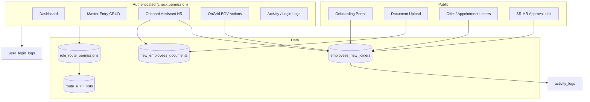

# APPL E-Digital Application — Project Documentation

**Product:** Ami Polymer (APPL) internal HR / onboarding platform  
**Stack:** Laravel 12, PHP 8.2+, Laravel Breeze, Tailwind CSS, Vite  
**Last reviewed:** June 2026 (from repository scan)

---

## 1. Purpose

This application is a Laravel-based **E-Digital** portal for Ami Polymer. It combines:

- **Authenticated admin/HR dashboards** with role-based URL permissions
- **Employee onboarding** (new joiners): profile, documents, offer/appointment letters, SR-HR approval, BGV via OnGrid
- **Master data:** quick links, users, employees, annual report forms
- **Audit & login logging** for compliance and troubleshooting

Candidates use **token-based public routes** (no login) for the onboarding portal, document upload, and letter signing.

---

## 2. Technology stack

| Layer | Choice |
|--------|--------|
| Framework | Laravel 12 |
| Auth UI | Laravel Breeze |
| PHP | ^8.2 |
| CSS | Tailwind CSS 3 + `@tailwindcss/vite` |
| JS | Alpine.js, Vite 6 |
| PDF | dompdf/dompdf ^3.1 |
| Images | intervention/image ^3.11 |
| Mail | PHPMailer ^7.0 (alongside Laravel mail) |
| Device parsing | jenssegers/agent (activity logs) |
| Tests | Pest ^3.8 |

---

## 3. Repository layout

```
edigital.appl/
├── app/                    # Application code
│   ├── Console/Commands/   # Artisan commands (route sync, etc.)
│   ├── Data/               # JSON-driven config (schemas, SR-HR team, policies)
│   ├── Http/
│   │   ├── Controllers/    # Auth, Dashboard, OnboardAssistant, OnGridWeb, AnnualReport
│   │   └── Middleware/     # Permissions, auto-logout, password change (optional)
│   ├── Listeners/          # Login/logout logging
│   ├── Models/             # Eloquent models
│   ├── Notifications/      # Custom reset password
│   ├── Providers/
│   ├── Support/            # Onboarding, OnGrid, PDF, mail, SR-HR helpers
│   ├── Traits/             # Auditable
│   └── View/Components/    # AppLayout, GuestLayout
├── bootstrap/app.php       # Middleware aliases, route loading
├── config/                 # Laravel + services.ongrid
├── database/migrations/    # Schema (21 migration files)
├── docs/                   # This file
├── form_join/              # Static HTML prototypes + JSON schemas (profile, joining, SR-HR)
├── MD-file/                # Legacy markdown notes (e.g. document upload spec)
├── public/                 # Web root + large theme assets under public/assets/theme/
├── resources/views/        # Blade templates (admin pages, frontend portal, emails, PDFs)
├── routes/                 # web.php, auth.php, onGrid.php, onboardAssistant.php
├── storage/                # Uploads, logs, compiled views
├── tests/                  # Pest unit/feature examples
├── user-form/              # Static HTML UI mockups (candidate flow)
├── vendor/                 # Composer dependencies
├── .env / .env.example
├── composer.json
├── package.json
└── README.md               # Quick start; links here for full detail
```

**Note:** `public/assets/theme/` contains hundreds of third-party plugin files (bootstrap-select, select2, dropzone, etc.) used by the admin UI theme. They are not application logic.

**Duplicates to be aware of:** Some paths exist with mixed casing or copy files (e.g. `EmployeeNewJoinerController copy.php`, duplicate `app\Support` entries on Windows). Prefer the non-`copy` controllers when editing.

---

## 4. Core modules

### 4.1 Authentication & users

- **Breeze** routes in `routes/auth.php` (login, register, password reset, verification).
- **Roles** on `users.role` (e.g. `superadmin`, `admin`, `user`, and others used in permission rows).
- **User fields:** `phoneno`, `emp_id`, `status`, `profile_image`, `password_changed_at`, `is_locked`, `locked_at`.
- **Password policy:** `User::passwordExpired()` — 60 days since `password_changed_at` (middleware `ForcePasswordChange` exists but is commented out in `bootstrap/app.php`).
- **Auto logout:** `AutoLogout` middleware — 5 minutes idle for non-superadmin users; writes `logout_reason = idle_auto` on `user_login_logs`.
- **Custom reset email:** `App\Notifications\ResetPasswordNotification`.

### 4.2 Role–route permissions

Access to authenticated pages is enforced by `CheckRoleRoutePermission` (`check.permission`):

1. **Superadmin** bypasses all checks.
2. Other roles: current path is normalized (`{id}` for numeric segments and certain status words).
3. Path must exist in `route_u_r_l_lists` (`RouteURLList` model).
4. Role must have that route ID in `role_route_permissions.url_ids` (JSON).

**Sync routes to DB:**

```bash
php artisan routes:store
```

Also available from UI: **Master Entry → Logs → Route List → Sync** (`Log.Routes.Sync`).

Implementation: `App\Support\RouteRegistrySync`, command `StoreRoutesToDatabase`.

### 4.3 Dashboard & master entry

| Area | Route prefix | Controller |
|------|----------------|------------|
| Dashboard | `/dashboard` | `DashboardController` |
| Quick links (admin CRUD) | `/master-entry/quick-link` | `QuickLinkController` |
| Quick links (frontend tile) | `/quick-link` | `F_QuickLinkController` |
| Employee list (users sheet) | `/master-entry/employee-list` | `UsersListController` |
| User roles & permissions | `/master-entry/user-role` | `UsersRoleListController` |
| Annual report forms | `/annual-report/view-form` | `AnnualReportViewFormController` |
| Activity logs | `/master-entry/logs/active-logs` | `SystemLogController` |
| Login logs | `/master-entry/logs/user-login-logs` | `SystemLogController` |
| Route registry | `/master-entry/logs/route-list` | `RouteUrlListController` |

### 4.4 Onboard Assistant (new joiners)

**HR (authenticated):**

- List/create/edit/show new joiners: `/onboard-assistant/new-employee-list`
- Document verify, resend email, download all, onboarding step actions, finalize

**Candidate (public, token/ID in URL):**

| Feature | Route pattern |
|---------|----------------|
| Onboarding portal | `GET/POST /onboarding/{token}` |
| Legacy document upload | `/Mph6MSf9L4NU4NWRRuxTYAvZM/...` |
| Offer letter view/sign/reject | `/offer-letter/...` |
| Appointment letter view/sign/reject | `/appointment-letter/...` |
| Thank you | `/thank-you` |
| SR-HR approval (token) | `/sr-hr/approval/{token}` |

**Controllers:** `OnboardAssistant\EmployeeNewJoinerController`, `NewJoinerUploadDocumentController`, `SrHrApprovalController`.

**Model:** `EmployeesNewJoiner` — soft deletes, full-field auditing via `Auditable` trait.

### 4.5 OnGrid (background verification)

Configured in `config/services.php` → `services.ongrid` (env: `ONGRID_BASE_URL`, `ONGRID_USERNAME`, `ONGRID_PASSWORD`, `ONGRID_COMMUNITY_ID`).

**Routes** (`routes/onGrid.php`, auth required):

- Create BGV link, poll status, list invites, delete invite, offering list
- Controller: `OnGridWeb\OnGridWebController`
- OnGrid helper: `App\Support\OnGrid` (single file)
- Stores `ongrid_id` and `ongrid_response` on `employees_new_joiners`

**Planned API (documentation only — pending approval):**  
[ONGRID_INITIATE_VERIFICATION.md](ONGRID_INITIATE_VERIFICATION.md) — Postman request **"Onboarding and Initiate Verification Copy"** (`POST .../individuals/initiate`). Replaces invite-only flow with onboard + start verifications in one call.

### 4.6 Activity & audit logging

- **Model changes:** `Auditable` trait on `User`, `EmployeesNewJoiner`, and other models — writes to `activity_logs` with user, IP, user agent (via Agent).
- **Login/logout:** `LogUserLogin`, `LogUserLogout` listeners on Laravel auth events.

---

## 5. Onboarding workflow

**User guide (HR + candidate, start to end):** [ONBOARDING_PORTAL_USER_GUIDE.md](ONBOARDING_PORTAL_USER_GUIDE.md)

State is driven by `employees_new_joiners.emp_onboarding_step` and related columns (`emp_document_status`, letter statuses, SR-HR JSON in `emp_sr_hr_approval`, etc.).

### 5.1 Step labels (human-readable)

Defined in `App\Support\OnboardingStepGate::humanStepLabel()`:

| Step key | Meaning |
|----------|---------|
| `start` | Invitation sent |
| `profile_completed` | Profile submitted |
| `hr_review` | Documents under HR review |
| `documents_submitted` / `documents_approved` / `documents_rejected` | Document pipeline |
| `offer_pending_sr_hr` / `offer_sr_rejected` / `offer_sent` / `offer_accepted` / `offer_rejected` | Offer letter flow |
| `registration_sent` → `registration_verified` | Registration letter |
| `bgv_started` / `bgv_completed` | OnGrid BGV |
| `join_forms_sent` / `join_forms_submitted` | Joining forms |
| `policy_signed` | Company policy acceptance |
| `appointment_*` | Appointment letter + SR-HR |
| `end` | Onboarding complete |

### 5.2 Gates & business rules

| Helper | Role |
|--------|------|
| `OnboardingStepGate` | Lock HR/candidate edits when finalized or appointment accepted + SR-HR approved |
| `OnboardingArchive` | Finalized/archived records |
| `SrHrLetterApproval` | Offer & appointment SR-HR tokens and approval state |
| `OnboardingLetterPdf` / `OnboardingLetterDocument` | PDF generation and document types |
| `OnboardingMail` | Candidate + HR notification emails |
| `OnboardingSignature` | Draw/upload signature for letters |
| `OnboardingReprocess` / `OnboardingLetterResend` | Corrections and resends |
| `CandidateEmploymentType` | Fresher vs experienced document sets |
| `OnboardingFileRules` | Upload validation |
| `HrAuthorizedSignature` / `App\Data\SrHrTeam` | Signatory images on PDFs |

**Model helpers** on `EmployeesNewJoiner`: `canProceedToOfferLetter()`, `hasCandidateSubmittedDocuments()`, `canEditPortalProfile()`, etc.

### 5.3 Candidate portal

- Blade: `resources/views/frontend/onboarding/portal.blade.php` and tab partials (`tab-info`, `tab-documents`, `tab-letter`, `tab-policy`).
- Profile schema: `form_join/profile-form-schema.json` (loaded via `App\Data\ProfileFormSchema`).
- Joining forms: `form_join/joining-form-schema.json`, `App\Data\JoiningFormSchema`.
- Policies: `form_join/company-policies.json`, `App\Data\CompanyPolicyDocuments`.

### 5.4 HR UI

- Primary screens under `resources/views/pages/new-join-employee/` (`index`, `create`, `edit`, `show` + partials for SR-HR, onboarding actions, joining summary).
- PDF templates: `resources/views/pdf/` (`offer_letter_pdf`, `appointment_letter_pdf`, etc.).
- Emails: `resources/views/emails/onboarding/*.blade.php`.

---

## 6. Database tables (migrations)

| Table | Purpose |
|-------|---------|
| `users` | Staff login accounts |
| `password_reset_tokens`, `sessions` | Auth infrastructure |
| `cache`, `jobs` | Laravel defaults |
| `quick_links` | Dashboard quick-link tiles |
| `employees` | Employee master (separate from new joiners) |
| `employees_new_joiners` | Onboarding candidates (extended by several migrations) |
| `new_employees_documents` | Per-candidate uploaded files metadata |
| `role_route_permissions` | Role → allowed route URL IDs (+ `quick_link_id` optional) |
| `route_u_r_l_lists` | Registered application paths for permission checks |
| `activity_logs` | Auditable model change history |
| `user_login_logs` | Login/logout sessions |
| `annual_report_view_forms` | Annual report feature |
| `labours` | Legacy/auxiliary (from earlier migration) |
| `theme_settings` | UI theme (model present) |

Key **employees_new_joiners** columns (after migrations): onboarding step/status, profile JSON, signatures, offer/appointment timestamps and statuses, OnGrid fields, SR-HR approval JSON, joining requirements, archive timestamp, employee ID, department, MRF, etc.

---

## 7. Routes file map

| File | Loaded from | Contents |
|------|-------------|----------|
| `routes/web.php` | `bootstrap/app.php` | Home, dashboard, master entry, annual report, logs; requires `auth.php`, `onGrid.php`, `onboardAssistant.php` |
| `routes/auth.php` | `web.php` | Breeze authentication |
| `routes/onboardAssistant.php` | `web.php` | Public onboarding + protected HR new-joiner routes |
| `routes/onGrid.php` | `web.php` | OnGrid API UI actions |
| `routes/console.php` | Artisan | Scheduled commands |

Health check: `GET /up`.

---

## 8. Application layer reference

### Models (`app/Models/`)

- `User`, `Employee`, `EmployeesNewJoiner`, `NewEmployeesDocument`
- `QuickLink`, `RoleRoutePermission`, `RouteURLList`
- `ActivityLog`, `UserLoginLog`
- `AnnualReportViewForm`, `ThemeSetting`, `Remarks`

### Support classes (`app/Support/`)

Onboarding pipeline, mail, PDF, signatures, OnGrid payload, route sync, SR-HR approval, file rules, HR display helpers.

### Data classes (`app/Data/`)

- `ProfileFormSchema`, `JoiningFormSchema`, `DocumentNamesList`
- `CompanyPolicyDocuments`, `SrHrTeam`

### Middleware

| Alias / class | Behavior |
|---------------|----------|
| `check.permission` | `CheckRoleRoutePermission` |
| `auto.logout` | `AutoLogout` (also appended to `web` group) |
| `ForcePasswordChange` | Available but not active in web group |

### Artisan commands

| Command | Description |
|---------|-------------|
| `php artisan routes:store` | Sync all app routes into `route_u_r_l_lists` |
| `php artisan ...` | `UpdateSiteStatusDaily` — scheduled maintenance (see `app/Console/Kernel.php`) |

### Frontend build

```bash
composer install
npm install
npm run dev          # Vite dev server
# or
npm run build        # Production assets
php artisan serve
```

Composer script `composer dev` runs server, queue, pail, and Vite concurrently.

---

## 9. Environment variables

| Variable | Usage |
|----------|--------|
| `APP_NAME`, `APP_URL`, `APP_KEY` | Application identity |
| `DB_*` | MySQL (README) or SQLite (`.env.example` default) |
| `MAIL_*` | Outbound email |
| `ONGRID_BASE_URL`, `ONGRID_USERNAME`, `ONGRID_PASSWORD`, `ONGRID_COMMUNITY_ID` | BGV integration |

Do not commit `.env` or `.env-live`.

---

## 10. Static assets & prototypes

| Path | Purpose |
|------|---------|
| `form_join/` | HTML form prototypes + JSON schemas used by PHP Data classes |
| `user-form/` | Standalone HTML mockups (profile, documents, offer, BGV status, flow images) |
| `MD-file/document.md` | Document upload field specification (tabs A–D, sizes, formats) |
| `public/assets/theme/` | Admin theme (CSS/JS vendors) |

---

## 11. Security notes

- **Superadmin** has unrestricted URL access.
- All other roles depend on **route registry + permission JSON** — new routes must be synced after deployment.
- Candidate routes use **opaque tokens** (`emp_url`) or legacy fixed path segments; SR-HR uses separate approval tokens.
- Sensitive uploads live under `storage/` (per-employee folders via `emp_folder_path`).
- Account lock: `users.is_locked` / `locked_at`.
- Password and tokens excluded from audit logs on `User`.

---

## 12. Testing

- `tests/Unit/ExampleTest.php`, `tests/Feature/` — Pest/Laravel defaults.
- Run: `composer test` or `php artisan test`.

---

## 13. Deployment checklist

1. Set `.env` (DB, mail, OnGrid, `APP_URL`).
2. `php artisan migrate`
3. `php artisan routes:store` (or sync from admin UI).
4. Seed/configure `role_route_permissions` for each role.
5. `npm run build` for production assets.
6. Ensure `storage/` and `bootstrap/cache/` are writable.
7. Configure web server document root to `public/` (or root `index.php` if using project root).

---

## 14. Related documentation

- [README.md](../README.md) — installation quick start
- [MD-file/document.md](../MD-file/document.md) — document upload form specification (tabs, file types, sizes)

---

## 15. High-level architecture diagram



---

*This document was generated from a full repository scan. Update it when adding major modules, routes, or integrations.*
